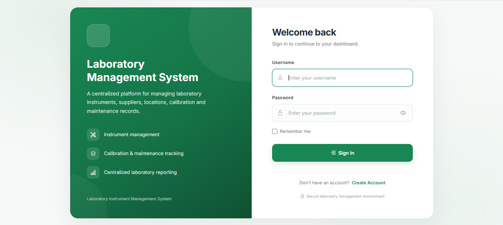
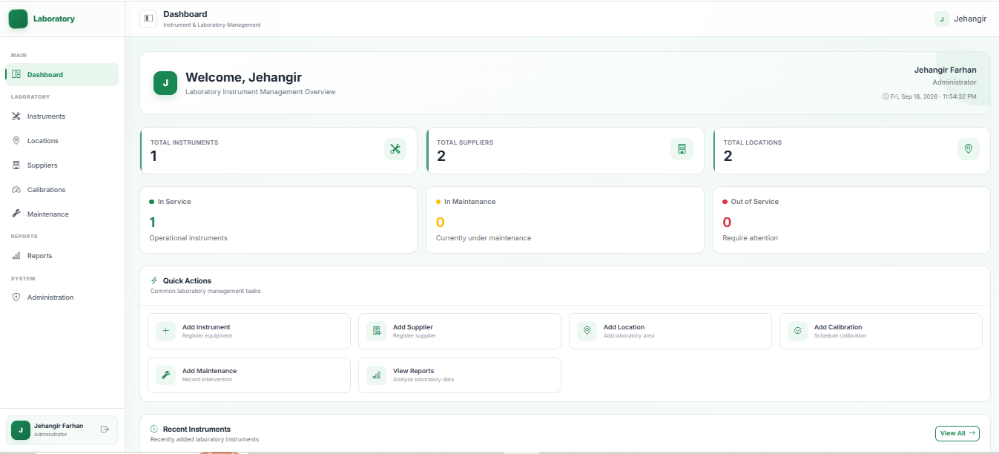
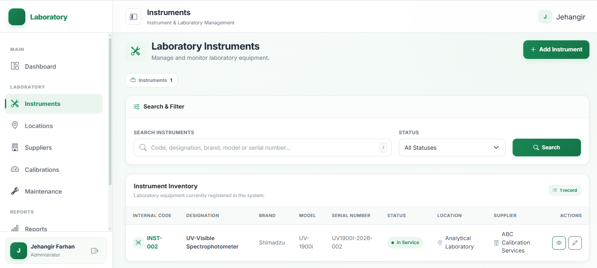
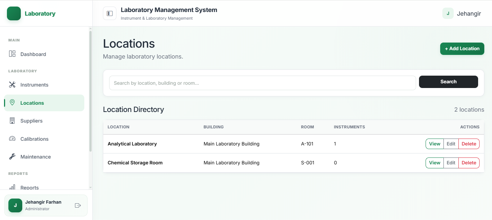
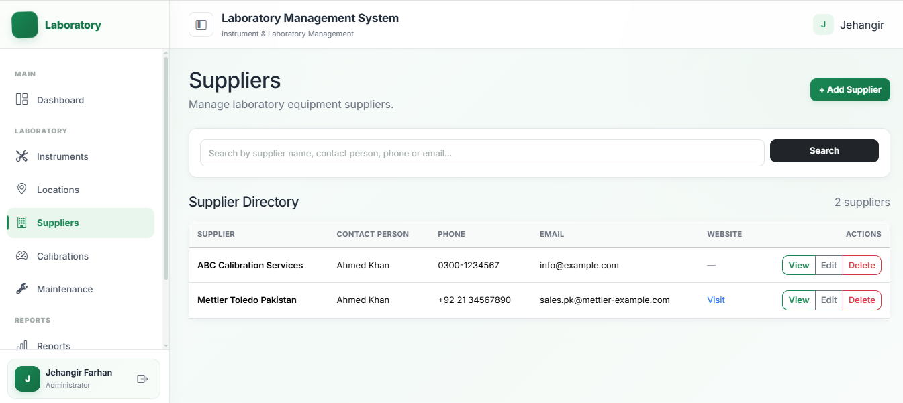
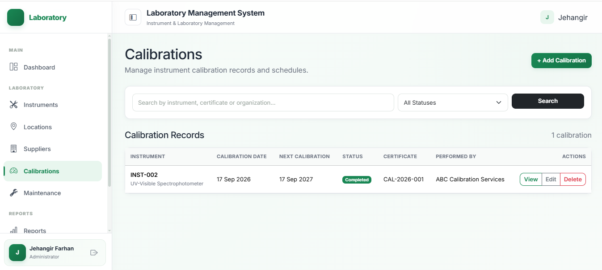
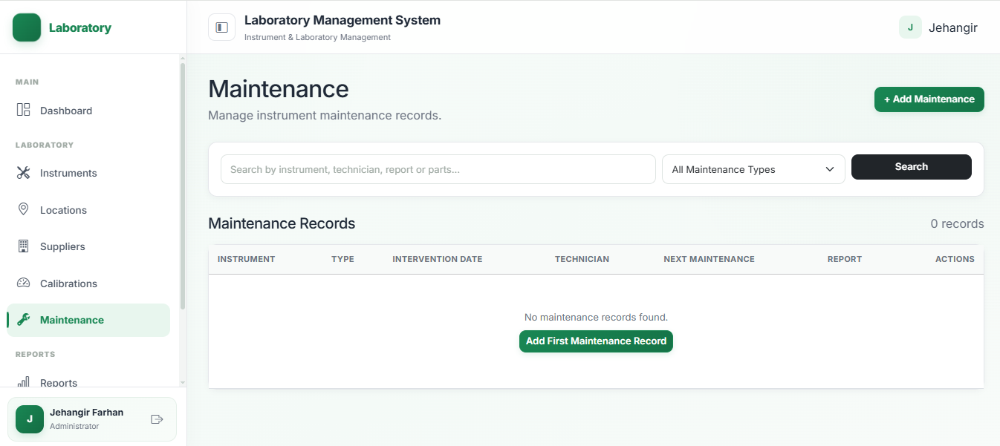
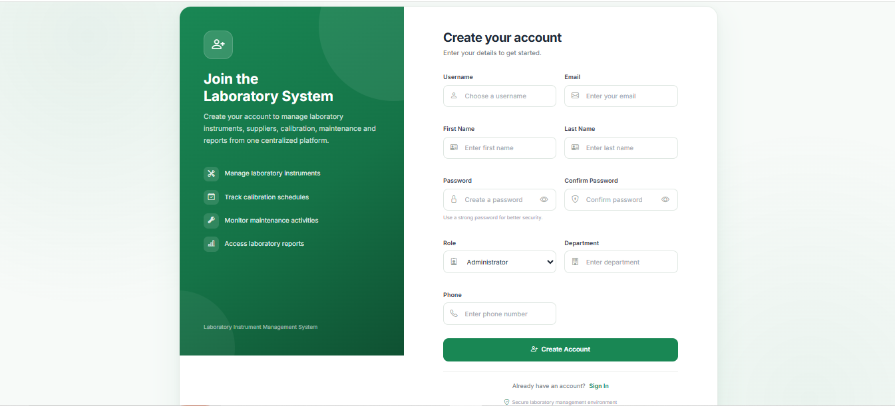

# 🧪 Laboratory Management System

A full-stack **Laboratory Management System** built with Django and MySQL to help laboratories manage instruments, locations, suppliers, calibrations, maintenance records, users, and operational information from a centralized web application.

The system provides a clean, responsive interface with role-aware authentication, organized laboratory modules, database-driven records, and a modern dashboard.

---

## 📸 Screenshots

### Login



### Dashboard



### Instruments



### Locations



### Suppliers



### Calibrations



### Maintenance



### User Registration



---

## ✨ Features

### 📊 Dashboard

* Centralized laboratory overview
* Summary statistics
* Quick access to major laboratory modules
* Clean and responsive interface
* User-specific navigation

### 🧰 Instrument Management

* Add and manage laboratory instruments
* Maintain instrument information
* Track instrument locations
* Associate instruments with suppliers
* Manage instrument-related records

### 📍 Location Management

* Create and manage laboratory locations
* Organize instruments according to their physical locations
* Centralized location records

### 🏢 Supplier Management

* Maintain supplier information
* Associate suppliers with laboratory instruments
* Centralized supplier records

### ⚙️ Calibration Management

* Maintain calibration records
* Track calibration dates
* Monitor calibration status and schedules
* Associate calibration information with instruments

### 🔧 Maintenance Management

* Maintain maintenance records
* Track maintenance activities
* Associate maintenance history with instruments
* Monitor maintenance information

### 📈 Reports

* Centralized reporting section
* Organized access to laboratory information
* Database-driven reporting workflow

### 👤 Authentication & Accounts

* User registration
* User authentication
* Login/logout functionality
* User profiles
* Role-based user information
* Protected authenticated application area

### 🎨 Modern UI

* Responsive layout
* Bootstrap 5 interface
* Bootstrap Icons
* Inter typography
* Responsive sidebar navigation
* Collapsible desktop sidebar
* Mobile navigation
* Toast/message-style notifications
* Smooth transitions and animations
* Scroll-to-top functionality
* Loading indicator
* Keyboard-friendly interactions
* Reduced-motion support
* Print-friendly layout

---

## 🛠️ Technology Stack

### Backend

* **Python**
* **Django 3.2.25**
* **MySQL 5.7**

### Frontend

* **HTML5**
* **CSS3**
* **JavaScript**
* **Bootstrap 5.3.3**
* **Bootstrap Icons**
* **Inter Font**

### Database

* **MySQL 5.7**

### Supporting Libraries

* `mysqlclient`
* `Pillow`
* `asgiref`
* `pytz`
* `sqlparse`
* `typing_extensions`
* `tzdata`

---

## 🏗️ Project Architecture

The project follows Django's modular application structure.

```text
LaboratoryInstrumentManagement/
│
├── accounts/          # Authentication and user management
├── calibrations/      # Calibration management
├── config/            # Django project configuration
├── dashboard/         # Dashboard and overview
├── instruments/       # Instrument management
├── locations/         # Laboratory locations
├── maintenance/       # Maintenance records
├── media/             # Uploaded media/files
├── reports/           # Reports
├── suppliers/         # Supplier management
├── templates/         # Shared HTML templates
├── Screenshots/       # Project screenshots
│
├── manage.py
├── requirements.txt
├── README.md
└── laboratory_management.sql
```

---

## 🗄️ Database

The application uses **MySQL 5.7** as its relational database.

The repository includes a database backup:

```text
laboratory_management.sql
```

The backup can be imported into a local MySQL installation to recreate the application's database structure and existing project data.

---

## 🚀 Installation & Setup

### 1. Clone the Repository

```bash
git clone https://github.com/YOUR-USERNAME/LaboratoryInstrumentManagement.git
```

Move into the project directory:

```bash
cd LaboratoryInstrumentManagement
```

---

### 2. Create a Virtual Environment

Windows:

```powershell
python -m venv venv
```

Activate it:

```powershell
venv\Scripts\Activate.ps1
```

For Command Prompt:

```cmd
venv\Scripts\activate
```

---

### 3. Install Dependencies

```bash
pip install -r requirements.txt
```

---

### 4. Configure MySQL

Make sure MySQL 5.7 is installed and running.

Create the database:

```sql
CREATE DATABASE laboratory_management;
```

Create a MySQL user:

```sql
CREATE USER 'lab_admin'@'localhost' IDENTIFIED BY 'YOUR_PASSWORD';
```

Grant database privileges:

```sql
GRANT ALL PRIVILEGES ON laboratory_management.* TO 'lab_admin'@'localhost';
```

Then:

```sql
FLUSH PRIVILEGES;
```

---

### 5. Configure Django Database Settings

Update the database configuration in:

```text
config/settings.py
```

Example:

```python
DATABASES = {
    'default': {
        'ENGINE': 'django.db.backends.mysql',
        'NAME': 'laboratory_management',
        'USER': 'lab_admin',
        'PASSWORD': 'YOUR_PASSWORD',
        'HOST': '127.0.0.1',
        'PORT': '3306',
    }
}
```

Replace `YOUR_PASSWORD` with your local MySQL password.

**Do not commit passwords or secret keys to GitHub.**

---

### 6. Import the Database

The repository contains:

```text
laboratory_management.sql
```

Import it into the newly created database.

Using the MySQL command-line client on Windows:

```cmd
mysql -u lab_admin -p laboratory_management < laboratory_management.sql
```

If `mysql` is not available in your PATH, use the full path to `mysql.exe`.

For a default MySQL Server 5.7 installation:

```cmd
"C:\Program Files\MySQL\MySQL Server 5.7\bin\mysql.exe" -u lab_admin -p laboratory_management < laboratory_management.sql
```

---

### 7. Run Django Checks

```bash
python manage.py check
```

The project should report:

```text
System check identified no issues.
```

---

### 8. Apply Migrations

```bash
python manage.py migrate
```

---

### 9. Create an Administrator

If required:

```bash
python manage.py createsuperuser
```

Follow the prompts to create the administrator account.

---

### 10. Start the Development Server

```bash
python manage.py runserver
```

Open:

```text
http://127.0.0.1:8000/
```

Django administration:

```text
http://127.0.0.1:8000/admin/
```

---

## 🔐 Security Notes

For development and deployment:

* Never commit passwords to GitHub.
* Never commit API keys or private credentials.
* Never expose Django's production `SECRET_KEY`.
* Use environment variables for sensitive configuration.
* Use `DEBUG = False` in production.
* Configure `ALLOWED_HOSTS` appropriately before deployment.
* Use HTTPS for production deployments.
* Use a dedicated production database user with appropriate privileges.

---

## 📁 Important Files

| File / Directory            | Purpose                            |
| --------------------------- | ---------------------------------- |
| `manage.py`                 | Django project management          |
| `config/`                   | Main Django configuration          |
| `accounts/`                 | Authentication and user management |
| `dashboard/`                | Dashboard                          |
| `instruments/`              | Instrument management              |
| `locations/`                | Location management                |
| `suppliers/`                | Supplier management                |
| `calibrations/`             | Calibration management             |
| `maintenance/`              | Maintenance management             |
| `reports/`                  | Reporting                          |
| `templates/`                | Shared templates                   |
| `media/`                    | Uploaded files                     |
| `Screenshots/`              | Application screenshots            |
| `requirements.txt`          | Python dependencies                |
| `laboratory_management.sql` | MySQL database backup              |

---

## 📱 Responsive Design

The application is designed to work across desktop and mobile screen sizes.

The interface includes:

* Responsive sidebar
* Mobile navigation
* Adaptive content layout
* Mobile-friendly controls
* Responsive tables and cards

---

## 🎯 Project Goals

The project was developed to provide a centralized system for managing laboratory assets and operational records while demonstrating practical skills in:

* Django web development
* Relational database design
* MySQL database management
* CRUD application development
* Authentication and authorization
* Frontend UI/UX design
* Responsive web design
* Database-driven workflows
* Modular Django architecture

---

## 🔮 Future Improvements

Potential future enhancements include:

* Advanced role and permission management
* Email notifications for upcoming calibrations
* Automated maintenance reminders
* Exporting reports to Excel/PDF
* Advanced analytics and dashboard charts
* Audit logs
* Search and advanced filtering
* REST API integration
* Automated database backups
* Production deployment
* Environment-based configuration

---

## 📌 Project Status

**Completed**

The current version provides a functional laboratory management platform with authentication, instrument management, locations, suppliers, calibration records, maintenance records, reports, and a responsive user interface.

---

## 👨‍💻 Author

**Jehangir Farhan**

BS Computer Science

Interested in:

* Cybersecurity
* Networking
* IT Support
* Web Development
* Systems & Infrastructure

---

## 📄 License

This project is intended primarily as a portfolio and educational project.

If you plan to reuse, modify, or distribute the project, please contact the author regarding licensing and usage.
